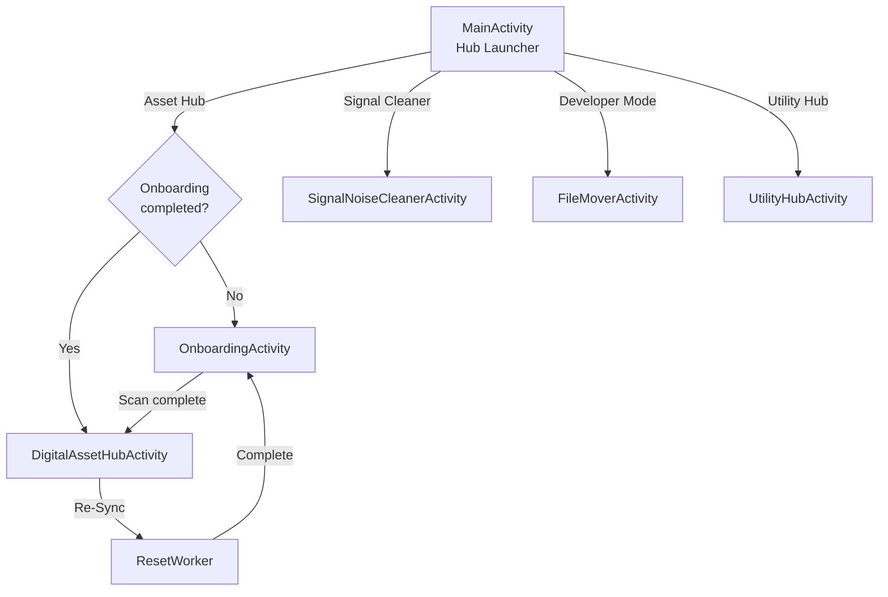

# Architecture Guide

## Overview

NeatNest uses **MVVM** with **Koin** DI, **Room** persistence, and **WorkManager** for background tasks. File access uses **SAF** for user-selected folders and **MediaStore** for device-wide scans. File classification is powered by a dual-model ML engine (Naive Bayes + TFLite).

**Current Version: 2.1.4.1**

## Layers

### View Layer

| Activity                     | ViewModel                | Purpose                                                                          |
| ---------------------------- | ------------------------ | -------------------------------------------------------------------------------- |
| `SplashActivity`             | —                        | Animated splash with logo fade-in + progress bar                                 |
| `MainActivity`               | —                        | Hub launcher with 4 color-coded navigation cards                                 |
| `OnboardingActivity`         | `OnboardingViewModel`    | Folder selection, root dir, scan config, ML model selection                      |
| `DigitalAssetHubActivity`    | `AssetHubViewModel`      | Folder cards → file drill-down, re-sync                                          |
| `SignalNoiseCleanerActivity` | `SignalCleanerViewModel` | Analytics dashboard + notification list                                          |
| `FileMoverActivity`          | —                        | Developer Mode: toolbar menus, context menus, popup menus, fragments, dialogs    |
| `UtilityHubActivity`         | —                        | Placeholder tools hub (video editor, file editor, data extractor, price tracker) |

### ViewModel Layer

ViewModels expose `StateFlow<UiState<T>>` where `UiState` is:

- `Loading` → `Success(data)` → or `Error(message)`

| ViewModel                | Repository                                    | Exposes                                         |
| ------------------------ | --------------------------------------------- | ----------------------------------------------- |
| `DashboardViewModel`     | FileRepository, NotificationRepository, Prefs | File count, notification count, recent activity |
| `OnboardingViewModel`    | FileRepository, Prefs                         | Folder selection, config state                  |
| `AssetHubViewModel`      | FileRepository, Prefs                         | Categories (folder cards), files by category    |
| `SignalCleanerViewModel` | NotificationRepository                        | Notifications, priority counts, top apps        |

### Repository Layer

- `FileRepository` — Files, folders, category queries, prefs access
- `NotificationRepository` — Notification CRUD + analytics queries

### Data Layer

- **Room** (`AppDatabase` v5) — `ProcessedFile`, `ProcessedNotification`, `TrackedFolder`
- **SharedPreferences** (`NeatNestPreferences`) — Root URI, onboarding status, scan mode, classification model

### ML Layer

- `FileClassificationEngine` — Interface + factory (reads model selection from prefs)
- `NaiveBayesClassifier` — Pure Kotlin, pre-trained word priors, Laplace smoothing, zero dependencies
- `TFLiteClassifier` — LiteRT wrapper, character-level tokenization, NaiveBayes fallback

## Background Workers

### AssetScannerWorker

Two-pass `CoroutineWorker`:

1. **Ingestion** — Copy/move files from source into root directory
2. **Classification** — ML engine sorts files into subdirectories (Study Material, Work Documents, Media, Clutter, or by extension)

Records `engineUsed` and `category` in the DB for each file.

### ResetWorker

Reverse-classification pipeline:

1. Reads all `ProcessedFile` records from DB
2. Moves each file back to `originalUri` (creates parent dir if needed)
3. Falls back to `Restored/` folder if original path is inaccessible
4. Empties root directory, clears all tables, resets onboarding

### NotificationService

`NotificationListenerService` that intercepts notifications, classifies priority via channel importance, and stores in Room.

## Dependency Injection (Koin)

Defined in `di/AppModule.kt`:

```
single { AppDatabase.build(context) }
single { processedFileDao() }
single { processedNotificationDao() }
single { trackedFolderDao() }
single { NeatNestPreferences(context) }
single { FileRepository(fileDao, folderDao, prefs) }
single { NotificationRepository(notifDao) }
viewModel { DashboardViewModel(fileRepo, notifRepo, prefs) }
viewModel { OnboardingViewModel(fileRepo, prefs) }
viewModel { AssetHubViewModel(fileRepo, prefs) }
viewModel { SignalCleanerViewModel(notifRepo) }
```

> Workers and NotificationService bypass Koin — they access `AppDatabase.getDatabase()` directly.

## Database Schema (Room, Version 5)

### processed_files

| Column      | Type      | Description                                         |
| ----------- | --------- | --------------------------------------------------- |
| originalUri | TEXT (PK) | Original file URI                                   |
| fileName    | TEXT      | Display name                                        |
| targetPath  | TEXT      | Current organized file URI                          |
| extension   | TEXT      | File extension                                      |
| timestamp   | LONG      | Processing time                                     |
| engineUsed  | TEXT      | Classifier used (NaiveBayes / TFLite / legacy)      |
| category    | TEXT      | Classification result (Study Material, Media, etc.) |

### processed_notifications

| Column      | Type           | Description           |
| ----------- | -------------- | --------------------- |
| id          | INT (PK, auto) | Auto-generated ID     |
| title       | TEXT?          | Notification title    |
| packageName | TEXT           | Source app package    |
| priority    | TEXT           | Classified importance |
| timestamp   | LONG           | Capture time          |

### tracked_folders

| Column     | Type      | Description  |
| ---------- | --------- | ------------ |
| uri        | TEXT (PK) | Folder URI   |
| folderName | TEXT      | Display name |
| dateAdded  | LONG      | Date added   |

## Navigation Flow



## UI Design System

Section-specific color palettes with tinted card backgrounds:

| Section           | Accent    | Light Tint | Dark Text |
| ----------------- | --------- | ---------- | --------- |
| Digital Asset Hub | `#2E7D32` | `#E8F5E9`  | `#1B5E20` |
| Signal Cleaner    | `#00897B` | `#E0F2F1`  | `#00695C` |
| Developer Mode    | `#7B1FA2` | `#F3E5F5`  | `#6A1B9A` |
| Utility Hub       | `#1976D2` | `#E3F2FD`  | `#1565C0` |

Background: `#F0F0F0` (light grey)
Status bar: `#0F3814` (dark green)
Navigation bar: `#F0F0F0` (light grey, dark icons)

## Dependencies

| Library             | Purpose                                              |
| ------------------- | ---------------------------------------------------- |
| Room + KSP          | Local persistence with compile-time SQL verification |
| WorkManager         | Background scan/reset operations                     |
| Koin                | Lightweight dependency injection                     |
| Material Components | Material Design 3 theming                            |
| TFLite / LiteRT     | On-device ML inference                               |
| Coil                | Image loading                                        |
| Lottie              | Rich animations                                      |
| DocumentFile        | SAF directory traversal                              |
| Navigation          | Fragment navigation (used in Developer Mode)         |

## Build Config

- `minSdk = 24` (Android 7.0)
- `targetSdk = 36` (Android 16)
- `compileSdk = 36`
- `versionName = "2.1.4.1"`

## Security

- `android:allowBackup="false"` — Prevents DB extraction via ADB
- `fallbackToDestructiveMigration(false)` — Forces explicit migrations
- SAF URI permissions — READ+WRITE only when move mode is enabled
- Permission separation — Complete Scan uses MediaStore; Pick Folders uses SAF only
