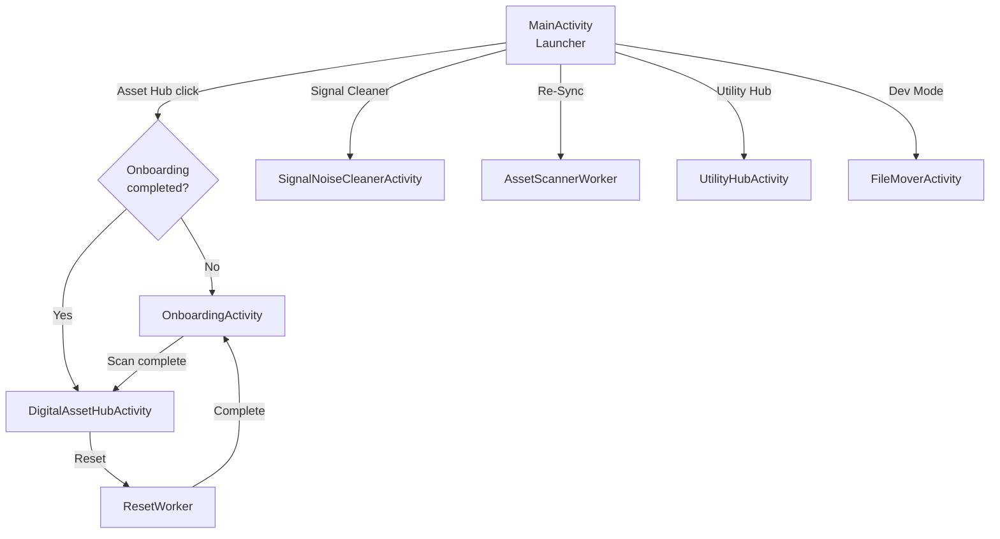

# Architecture Guide

## Overview

NeatNest follows the **MVVM (Model-View-ViewModel)** pattern with **Koin** for dependency injection and **Room** for local persistence. Background work is handled by **WorkManager**, and file access uses Android's **Storage Access Framework (SAF)** for user-selected folders and **MediaStore** for device-wide scans.

## Layers

### View Layer (Activities)

Each screen is an `AppCompatActivity` that observes data from its ViewModel via `StateFlow` or `LiveData`:

| Activity                     | ViewModel                | Purpose                                                |
| ---------------------------- | ------------------------ | ------------------------------------------------------ |
| `MainActivity`               | `DashboardViewModel`     | Dashboard with counts, recent activity, and navigation |
| `OnboardingActivity`         | `OnboardingViewModel`    | Folder selection, root directory, scan configuration   |
| `DigitalAssetHubActivity`    | `AssetHubViewModel`      | Displays organized files, reset functionality          |
| `SignalNoiseCleanerActivity` | `SignalCleanerViewModel` | Displays captured notifications, clear functionality   |
| `FileMoverActivity`          | —                        | Menu and fragment lifecycle demo (no ViewModel needed) |
| `UtilityHubActivity`         | —                        | Utility tools with rescan                              |

### ViewModel Layer

ViewModels expose UI state via `StateFlow<UiState<T>>` where `UiState` is a sealed class:

- `UiState.Loading` — Initial state
- `UiState.Success(data)` — Data loaded successfully
- `UiState.Error(message)` — Error occurred

### Repository Layer

Repositories abstract the data sources (DAOs and SharedPreferences):

- `FileRepository` — File operations, tracked folders, preferences
- `NotificationRepository` — Notification CRUD operations

### Data Layer

- **Room Database** (`AppDatabase`) — Stores `ProcessedFile`, `ProcessedNotification`, and `TrackedFolder` entities.
- **SharedPreferences** (`NeatNestPreferences`) — Stores root URI, onboarding status, move/copy mode, and scan mode.

## Background Workers

### AssetScannerWorker

Runs as a `CoroutineWorker` via WorkManager. Two-pass pipeline:

1. **Pass 1 (Ingestion):** Copies/moves files from source folders (SAF) or MediaStore into the root directory.
2. **Pass 2 (Classification):** Moves files from root into subdirectories using `DigitalAssetHub` smart classification (Study Material → `Study Material/`, Clutter → `Clutter/`, uncategorized → by extension like `jpg/`).

Key safety features:

- Files are only deleted after confirmed successful copy.
- Database `targetPath` is updated after every reclassification move.
- MediaStore permissions are only required for Complete Scan mode; Pick Folders mode uses SAF permissions.

### ResetWorker

Reverses the organization process:

1. Recursively walks the root directory tree (not stale DB paths).
2. Copies each file to `Downloads/NeatNest_Restored/` via MediaStore.
3. Only deletes source files after confirmed successful copy.
4. Clears all database tables and SharedPreferences.

### NotificationService

A `NotificationListenerService` that:

1. Intercepts every posted notification.
2. Classifies priority using the notification channel importance (API 26+) or legacy priority.
3. Stores the notification in Room via a coroutine.

## Dependency Injection (Koin)

Defined in `di/AppModule.kt`:

```
single { AppDatabase.build(context) }
single { get<AppDatabase>().processedFileDao() }
single { get<AppDatabase>().processedNotificationDao() }
single { get<AppDatabase>().trackedFolderDao() }
single { NeatNestPreferences(context) }
single { FileRepository(dao, folderDao, prefs) }
single { NotificationRepository(dao) }
viewModel { DashboardViewModel(fileRepo, notifRepo, prefs) }
viewModel { OnboardingViewModel(fileRepo, prefs) }
viewModel { AssetHubViewModel(fileRepo, prefs) }
viewModel { SignalCleanerViewModel(notifRepo) }
```

> **Note:** Workers (`AssetScannerWorker`, `ResetWorker`) and `NotificationService` bypass Koin and access `AppDatabase.getDatabase()` directly due to Android framework constraints on worker/service construction.

## Database Schema (Room, Version 4)

### processed_files

| Column      | Type      | Description                |
| ----------- | --------- | -------------------------- |
| originalUri | TEXT (PK) | Original file URI          |
| fileName    | TEXT      | Display name               |
| targetPath  | TEXT      | Current organized file URI |
| extension   | TEXT      | File extension             |
| timestamp   | LONG      | Processing time            |

### processed_notifications

| Column      | Type           | Description           |
| ----------- | -------------- | --------------------- |
| id          | INT (PK, auto) | Auto-generated ID     |
| title       | TEXT?          | Notification title    |
| packageName | TEXT           | Source app package    |
| priority    | TEXT           | Classified importance |
| timestamp   | LONG           | Capture time          |

### tracked_folders

| Column     | Type      | Description  |
| ---------- | --------- | ------------ |
| uri        | TEXT (PK) | Folder URI   |
| folderName | TEXT      | Display name |
| dateAdded  | LONG      | Date added   |

## Navigation Flow



## Security Measures

- `android:allowBackup="false"` — Prevents database extraction via ADB.
- `fallbackToDestructiveMigration(false)` — Forces explicit migrations instead of silent data wipes.
- SAF URI permissions — Only requests READ+WRITE when move mode is enabled.
- Permission separation — Complete Scan requires MediaStore permissions; Pick Folders uses SAF only.
